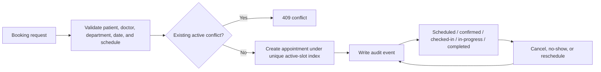

# Appointment Workflow

```mermaid
flowchart LR
  REQUEST[Booking request] --> VALIDATE[Validate patient, doctor, department, date, and schedule]
  VALIDATE --> CONFLICT{Existing active conflict?}
  CONFLICT -- Yes --> REJECT[409 conflict]
  CONFLICT -- No --> CREATE[Create appointment under unique active-slot index]
  CREATE --> AUDIT[Write audit event]
  AUDIT --> STATUS[Scheduled / confirmed / checked-in / in-progress / completed]
  STATUS --> CANCEL[Cancel, no-show, or reschedule]
  CANCEL --> AUDIT
```

Availability checks are advisory; the MongoDB partial unique index remains the concurrency boundary.
