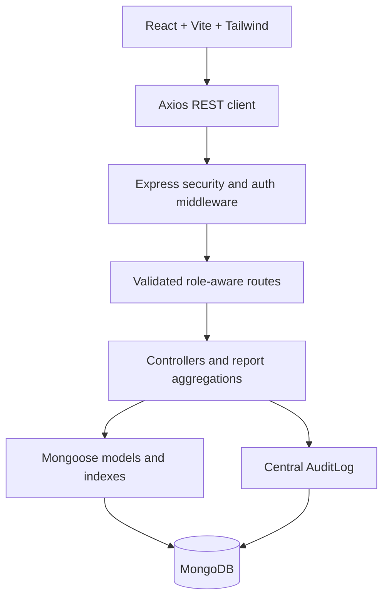

# System Architecture Diagram

```mermaid
flowchart TD
  UI[React + Vite + Tailwind] --> API[Axios REST client]
  API --> MW[Express security and auth middleware]
  MW --> ROUTES[Validated role-aware routes]
  ROUTES --> CTRL[Controllers and report aggregations]
  CTRL --> MODELS[Mongoose models and indexes]
  MODELS --> DB[(MongoDB)]
  CTRL --> AUDIT[Central AuditLog]
  AUDIT --> DB
```

The backend owns authorization and data filtering; frontend navigation is only a usability layer.
